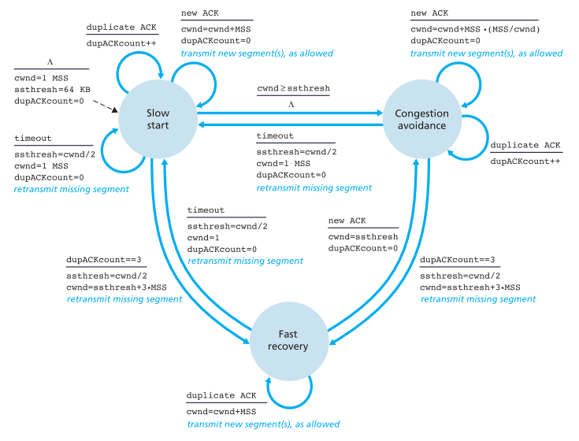

# LFTP 设计文档

### 拥塞控制

拥塞窗口`cwnd`和慢启动阈值`ssthresh`的变化依照如下状态图进行：

`cwnd`的单位为1MSS，这里将MSS设为数据包的大小。在慢启动状态，`cwnd`每经一个RTT翻倍，而在拥塞避免状态，每经一个RTT则加1MSS。但由于RTT不好统计，故这里用收到新的ACK来触发`cwnd`的改变，因为涉及到除法运算，`cwnd`用`double`来存储。用一个布尔变量`isQuickRecover`表示当前是否处于快速恢复状态

具体操作如下：

- 当收到正确的ACK时：

- 当收到冗余ACK时：

  - 若当前处于快速恢复状态：

    `cwnd ++`

  - 若不处于快速恢复状态：

    `duplicateAck ++`

- 当冗余ACK数量达到3个时：

- 出现超时时：

  `ssthresh = cwnd / 2`, `cwnd = 1`